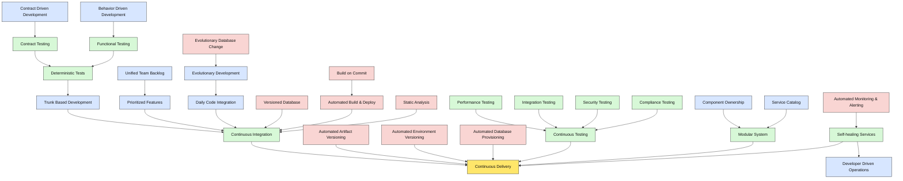

# 2015 CD Dependency Diagram

This is the diagram Bryan Finster created to decompose the CD problem for the original pilot.

```mermaid
flowchart TD
%% ========= Nodes =========
%% Top practices
CDD["Contract Driven Development"]:::behavior
BDD["Behavior Driven Development"]:::behavior
SA["Static Analysis"]:::auto
EDBC["Evolutionary Database Change"]:::auto

%% Testing path
CT["Contract Testing"]:::enabled
FT["Functional Testing"]:::enabled
DT["Deterministic Tests"]:::enabled
TBD["Trunk Based Development"]:::behavior

%% Team/backlog path
UTB["Unified Team Backlog"]:::behavior
PF["Prioritized Features"]:::behavior
ED["Evolutionary Development"]:::behavior
DCI["Daily Code Integration"]:::behavior
VD["Versioned Database"]:::auto

%% Build/CI/CD core
BoC["Build on Commit"]:::auto
ABD["Automated Build & Deploy"]:::auto
CI["Continuous Integration"]:::enabled
CD["Continuous Delivery"]:::core

%% CD capability areas
AAV["Automated Artifact Versioning"]:::auto
AEV["Automated Environment Versioning"]:::auto
ADP["Automated Database Provisioning"]:::auto
CTG["Continuous Testing"]:::enabled
MS["Modular System"]:::enabled
SHS["Self-healing Services"]:::enabled

%% Testing specializations
PT["Performance Testing"]:::enabled
IT["Integration Testing"]:::enabled
ST["Security Testing"]:::enabled
CTC["Compliance Testing"]:::enabled

%% Ops/ownership/catalog
AMA["Automated Monitoring & Alerting"]:::auto
DDO["Developer Driven Operations"]:::behavior
CO["Component Ownership"]:::behavior
SCAT["Service Catalog"]:::behavior

%% ========= Edges =========
%% Foundations -> Tests
CDD --> CT
BDD --> FT
CT --> DT
FT --> DT

%% Testing -> Trunk -> CI
DT --> TBD
TBD --> CI

%% Team/backlog/development -> CI
UTB --> PF
PF --> CI
EDBC --> ED
ED --> DCI
DCI --> CI
VD --> CI

%% Build path -> CI
BoC --> ABD --> CI
SA --> CI

%% CI -> CD
CI --> CD

%% Capabilities now point INTO CD
AAV --> CD
AEV --> CD
ADP --> CD
CTG --> CD
MS --> CD
SHS --> CD

%% Capability fan-ins (still make sense hierarchically)
PT --> CTG
IT --> CTG
ST --> CTG
CTC --> CTG

CO --> MS
SCAT --> MS

AMA --> SHS
SHS --> DDO

%% ========= Styling =========
classDef auto fill:#f9d5d3,stroke:#333,stroke-width:1px,color:#111;
classDef enabled fill:#d7f8d7,stroke:#333,stroke-width:1px,color:#111;
classDef behavior fill:#d7e6ff,stroke:#333,stroke-width:1px,color:#111;
classDef core fill:#ffe66a,stroke:#333,stroke-width:1px,color:#111;
```
